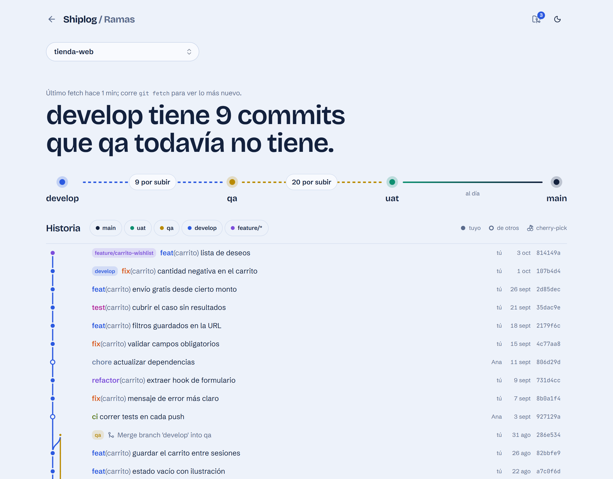
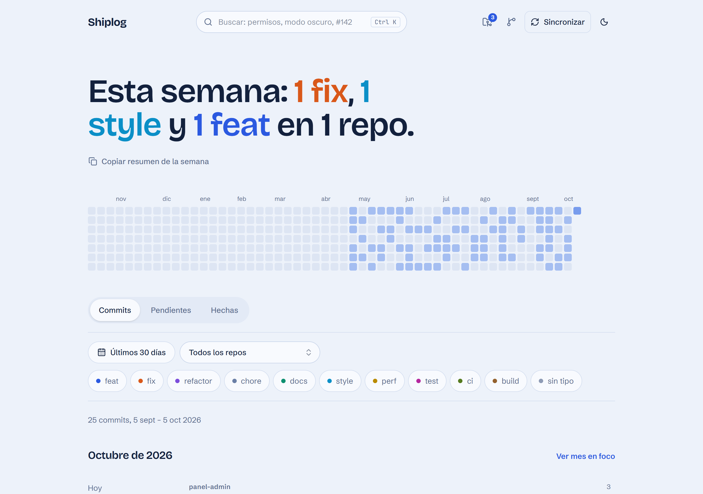
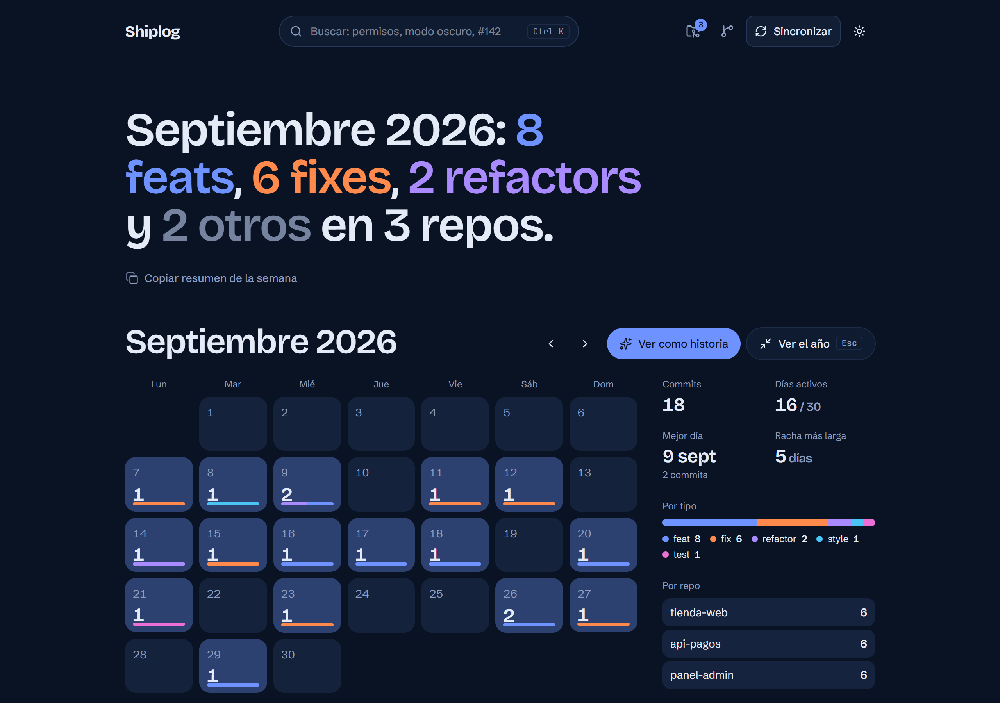
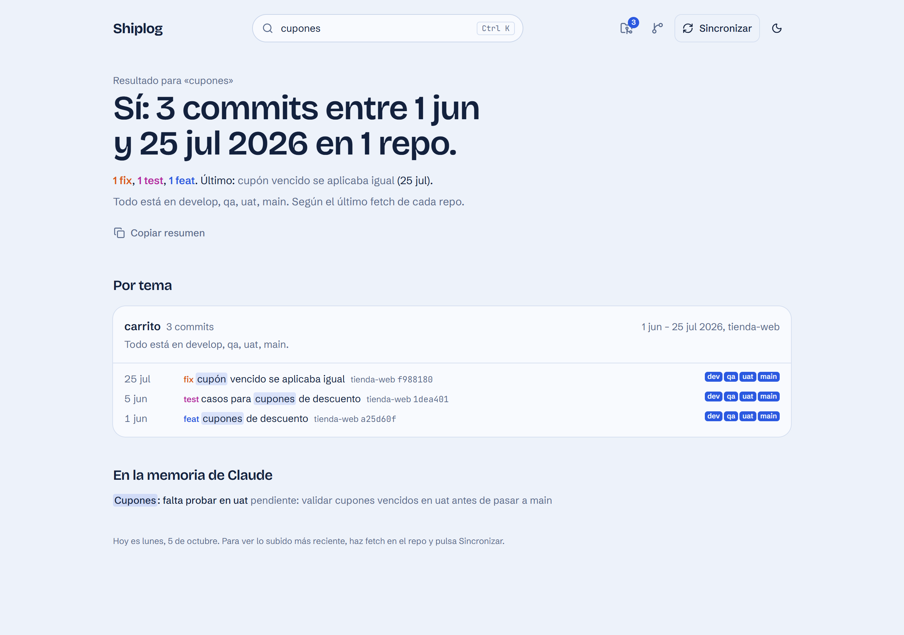
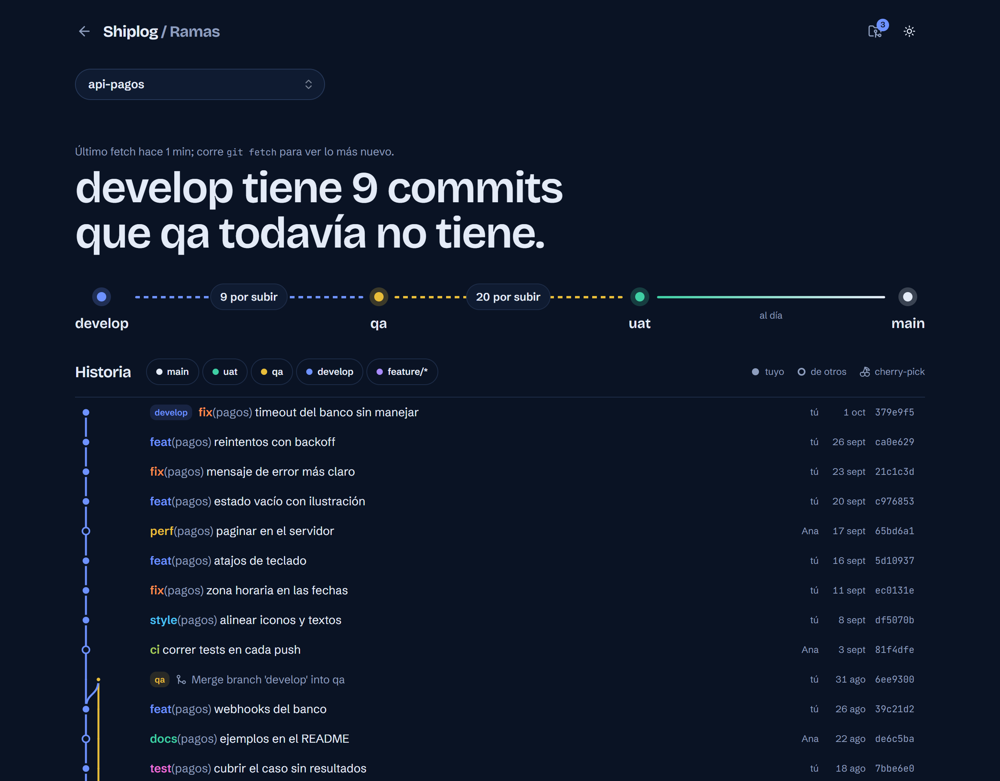

# Shiplog

**Your git history as a work log.** A local web app that reads the repos in a folder and shows what you did each day, how your commits flow between `develop → qa → uat → main`, and what is still waiting to be promoted. Spanish UI, runs 100% on your machine.

**Live demo (read-only, sample repos):** [shiplog.jotapol.com](https://shiplog.jotapol.com)



[Español abajo ↓](#español)

## What it does

- **Daily timeline.** Your commits grouped by day, repo and topic (conventional commit scope), with a contribution heatmap and copy-ready summaries for standups.
- **Branch flow (gitflow view).** A commit graph with lanes per branch family (`main`, `uat`, `qa`, `develop`, `feature/*`, `hotfix/*`), plus an environment pipeline that tells you exactly how many commits each environment is missing. Pick which branches each repo tracks and in what order (by default `develop → qa → uat → main`); the home page sums up how far each repo is from production.
- **Cherry-pick tracking.** The same change on several branches is detected (author date + subject), so hotfixes cherry-picked to `main` count as promoted, and the app warns you when something reached `main` but never came back to `develop`.
- **Search.** Finds commits, tasks and notes by topic, ignoring accents and plurals, and answers in a sentence: "Yes: 3 commits between Jun 1 and Jul 25 in 1 repo."
- **Tasks.** Light task tracking linked to commits by ticket id or keyword.
- **Month in focus and a scroll story** of your month.

| | |
| --- | --- |
|  |  |
|  |  |

## Try it in one minute

Requires Node 22.9+, pnpm and git.

```bash
pnpm install
pnpm demo        # creates 3 sample repos in .demo/ and opens http://127.0.0.1:3211
```

The demo uses its own database and repos; nothing touches your real work.

## Use it with your repos

```bash
cp .env.example .env.local   # set SHIPLOG_ROOT to the folder that contains your repos
pnpm dev                     # http://127.0.0.1:3210
```

Every git repo inside `SHIPLOG_ROOT` is tracked, at any depth (new ones are picked up on each sync; removing one in the app hides it for good). Only **your** commits count (author = `git config user.email` of each repo). Branch data comes from your last `git fetch`; the app never fetches or pushes.

| Variable | Default | |
| --- | --- | --- |
| `SHIPLOG_ROOT` | parent folder of the app | Folder with your repos |
| `SHIPLOG_DATA` | `./data` | Local database (PGlite) |

### With Docker (no Node needed)

```bash
cp .env.example .env.local                           # set SHIPLOG_ROOT
docker compose --env-file .env.local up -d --build   # http://127.0.0.1:3210
```

Your repos are mounted read-only and the database lives in `./data`, shared with `pnpm dev` (don't run both at once). To sync a repo after a commit without Node:

```bash
curl -X POST "http://127.0.0.1:3210/api/sync?repo=$(git rev-parse --show-toplevel)"
```

### From scripts or other tools

```bash
pnpm sync [repo-path]                         # import new commits
pnpm task "title" --repo r --keywords "#142"  # create a task
pnpm task:status <id> <pending|doing|done>
```

With the app running they go through its API; otherwise they open the database directly.

### Releases

```bash
pnpm release <patch|minor|major>   # bumps package.json, updates CHANGELOG.md, commits and tags vX.Y.Z
git push --follow-tags
```

The version shows in the app footer.

## Stack

Next.js 16 (App Router), React 19, Tailwind CSS 4, Base UI, Motion, Drizzle ORM over PGlite (embedded Postgres, no server to install).

---

## Español

**Demo en vivo (solo lectura, con repos de ejemplo):** [shiplog.jotapol.com](https://shiplog.jotapol.com)

**Tu historial de git convertido en bitácora.** App web local que lee los repos de una carpeta y te muestra qué hiciste cada día, cómo fluyen tus commits entre `develop → qa → uat → main` y qué falta subir a cada ambiente.

- **Timeline por día** con heatmap y resúmenes listos para copiar en la daily.
- **Vista de ramas tipo gitflow:** grafo de commits por carril y la ruta de ambientes con lo que falta por subir. Eliges qué ramas sigue cada repo y en qué orden; la portada resume qué tan lejos está cada uno de producción.
- **Cherry-picks:** reconoce el mismo cambio en varias ramas y avisa si algo llegó a `main` sin pasar por `develop`.
- **Búsqueda** por tema, sin importar tildes ni plurales.
- **Tareas** ligadas a commits por ticket o palabra clave.

```bash
pnpm install
pnpm demo                    # demo con repos de ejemplo en http://127.0.0.1:3211
cp .env.example .env.local   # SHIPLOG_ROOT = carpeta con tus repos
pnpm dev                     # http://127.0.0.1:3210
# o sin Node: docker compose --env-file .env.local up -d --build
```

## License

[Apache 2.0](LICENSE). The JOTAPOL DEV name and logo are not covered by the license.

---

<p align="center">
  <a href="https://github.com/jotapoldev">
    <picture>
      <source media="(prefers-color-scheme: dark)" srcset="docs/brand/jotapol-oscuro.png">
      
    </picture>
  </a>
  <br>
  <sub>Hecho por JOTAPOL DEV</sub>
</p>
